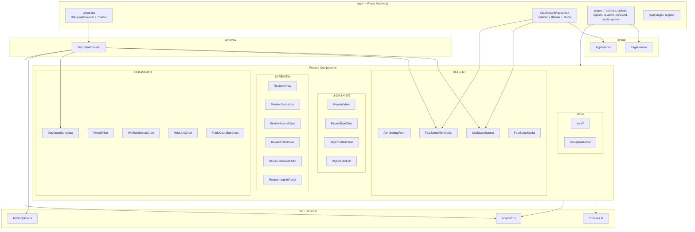

# Component Structure — IronTrader Prototype

> **목적**: feature 컴포넌트 계층·의존 관계·구조적 개선점 SSOT.  
> **범위**: `src/components/` (feature) + layout + app 조립. `components/ui/*` shadcn은 제외.  
> **기준일**: 2026-05-28

---

## 1. 전체 계층 차트



---

## 2. Feature 도메인별 트리

### 2.1 Alert & Discipline (UI-ALERT-001/002)

```
AlertSettingForm          ← settings/page
CooldownBanner            ← (dashboard)/layout
FactBombAlertModal        ← (dashboard)/layout (breach auto)
FactBombModal             ← (dashboard)/page (manual)
  └─ FactBombReportBody   ← internal (shared report UI)
DisciplineProvider        ← contexts/ (not components/, but owns state)
```

### 2.2 Dashboard Analytics (UI-DASH-001)

```
DashboardAnalytics
├── PeriodFilter
├── SummaryMetric         ← internal (dashboard-analytics.tsx)
├── WinRateDonutChart
├── MddLineChart
└── TradeCountBarChart
```

### 2.3 Reports (UI-DASH-002)

```
ReportsView
├── PageHeader
├── ReportTypeTabs
├── ReportDetailPanel
└── ReportCardList
    └── ReportCard        ← internal
```

### 2.4 Reviews (UI-REVIEW-001/002)

```
ReviewsView
├── PageHeader
└── ReviewJournalList
    └── ReviewJournalCard → Link /review/[id]

ReviewDetailView
├── ReviewTimelineChart
└── ReviewInsightsPanel
```

### 2.5 Auth & Upload

```
AuthFormLayout
├── LoginForm
└── RegisterForm

CsvUploadZone             ← upload/page (+ PageHeader in page)
```

---

## 3. 의존성 매트릭스 (요약)

| 컴ponent | lib | actions | context | ai flow |
|----------|-----|---------|---------|---------|
| AlertSettingForm | alert-settings | saveAlertSettings | — | — |
| CooldownBanner | discipline | — | useDiscipline | — |
| FactBomb* | — | — | useDiscipline (Alert only) | aiRealityCheckFactBomb |
| DashboardAnalytics | dashboard-fixtures | — | — | — |
| ReportsView | report-fixtures | — | — | — |
| ReviewsView | review-fixtures | — | — | — |
| ReviewDetailView | review-detail-fixtures | — | — | — |
| CsvUploadZone | csv-upload | processCsvUpload | — | — |
| Login/RegisterForm | auth-validation | auth | — | — |

**관찰**: feature 컴ponent → `lib/` fixture 의존이 dominant. actions는 mutation 경로에만 사용 — **단방향 데이터 흐름** 유지.

---

## 4. 현재 구조 강점

| 항목 | 설명 |
|------|------|
| **Route group 분리** | `(auth)` vs `(dashboard)` — 레이아웃 concern 분리 |
| **Fixture 격리** | `lib/*-fixtures.ts` — UI와 mock 데이터 decouple |
| **Server Action 규칙** | schema/type을 `lib/`로 분리 — Next.js `"use server"` 준수 |
| **공통 레이아웃** | `PageHeader` + globals.css utility — 시각적 계층 통일 |
| **전역 규율 단일 Provider** | `DisciplineProvider` — breach/cooldown/Fact-Bomb 일원화 |
| **Task ID 주석** | `@overview [UI-*]` — SRS Task 추적 가능 |

---

## 5. 개선점 분석

### 5.1 높음 (다음 단계 MVP)

| 이슈 | 현재 | 개선 방향 |
|------|------|-----------|
| **Fact-Bomb 이중 모달** | `FactBombAlertModal` + `FactBombModal` + shared `FactBombReportBody` | `useFactBombAnalysis()` hook + `FactBombDialog` 단일 compound component |
| **페이지 inline mock** | `audit/page`, `system/page` — fixture 없이 page 내 상수 | `lib/audit-fixtures.ts`, `lib/system-fixtures.ts` 추출 |
| **Dashboard SummaryMetric** | `dashboard-analytics.tsx` 내부 private | `components/dashboard/summary-metric.tsx` 분리 (재사용·테스트) |
| **ReportCard private** | `report-card-list.tsx` 내부 | 별도 파일 또는 card list generic pattern |

### 5.2 중간 (품질·유지보수)

| 이슈 | 현재 | 개선 방향 |
|------|------|-----------|
| **Client page 과다** | settings, dashboard page 등 `"use client"` | Server Component wrapper + client island 분리 |
| **중복 review route** | `/review` redirect + `/reviews` | Next.js redirect in config 또는 단일 canonical |
| **DisciplineProvider 크기** | ~230 lines, bootstrap+breach+tick | `useDisciplineBootstrap`, `useCooldownTick` hooks 분리 |
| **Toast 전역 reducer** | shadcn boilerplate 그대로 | 프로젝트 wrapper `lib/toast.ts` thin layer |

### 5.3 낮음 (프로토타입 acceptable)

| 이슈 | 비고 |
|------|------|
| shadcn `ui/*` 미주석 | 의도적 제외 — upstream sync 용이 |
| Mock data 하드코딩 | Authenticated Vault 연동 시 교체 |
| Export PDF / Share 버튼 | ReportsView — placeholder, no-op |

---

## 6. 권장 디렉터리 진화 (Post-Prototype)

```
src/
├── components/
│   ├── discipline/     ← alert form, cooldown, fact-bomb (alert domain 통합)
│   ├── dashboard/
│   ├── reports/
│   ├── reviews/
│   ├── auth/
│   └── upload/
├── features/             ← (optional) page-specific hooks + fixtures co-location
│   └── discipline/
│       ├── hooks/
│       └── fixtures/
```

---

## 7. 관련 문서

- [UX_FLOW.md](./UX_FLOW.md) — 사용자 시나리오
- [ARCHITECTURE.md](./ARCHITECTURE.md) — 레이어·call-flow
- [CODE_QUALITY.md](./CODE_QUALITY.md) — 품질 평가
- [CODE_INDEX.md](./CODE_INDEX.md) — 파일 경로 카탈로그
