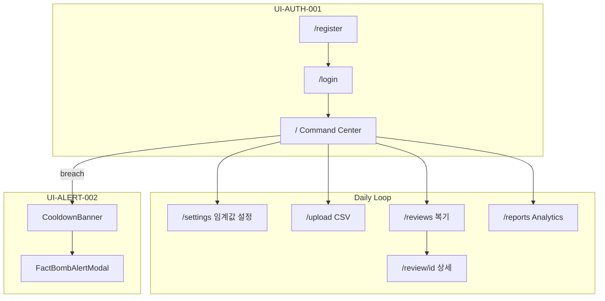

# UX Flow — IronTrader Prototype

> **목적**: MVP UI 프로토타입의 핵심 사용자 시나리오·화면 전환·피드백 흐름 SSOT.  
> **대상**: PM, 디자이너, 개발자, AI 에이전트.  
> **기준일**: 2026-05-28 | **단계**: Mock/fixture 기반 UI 프로토타입 완료

---

## 1. UX 원칙 (프로토타입)

| 원칙 | 구현 |
|------|------|
| **3분 Snap-Scan** | 복기 일지 목록 → 카드 1장으로 당일 핵심 파악 → 상세는 선택적 |
| **규율 강제** | 임계값 초과 시 쿨타임 + Fact-Bomb — 감정적 매매 차단 UX |
| **데이터 투명성** | KPI·차트·리포트에 단위(%, 원, 회) 명시 |
| **점진적 공개** | Command Center(실시간) → Analytics(기간) → Review(일별) |

---

## 2. 핵심 시나리오 맵

---

## 3. 시나리오별 상세 Flow

### S1. 온보딩 · 인증 (UI-AUTH-001)

| 단계 | 화면 | 사용자 행동 | 시스템 반응 |
|------|------|-------------|-------------|
| 1 | `/register` | 이메일·비밀번호 입력 | `registerSchema` 실시간 검증 |
| 2 | 동일 | 회원가입 클릭 | `registerUser` mock → toast → `/login` |
| 3 | `/login` | 로그인 클릭 | `loginUser` mock → toast → `/` |

**피드백**: toast (성공/실패), 폼 필드 inline error.

---

### S2. Command Center · Live Session (UI-DASH-001 + UI-ALERT-002)

| 단계 | 화면 | 사용자 행동 | 시스템 반응 |
|------|------|-------------|-------------|
| 1 | `/` | Start Session | `isSessionActive=true`, 매매 기록 버튼 활성 |
| 2 | `/` | +1 Trade / +1% Loss | `sessionMetrics` 갱신, 임계값 80% 근접 시 빨간 강조 |
| 3 | `/` | 임계값 초과 | `evaluateDisciplineBreach` → 30분 쿨타임 → sticky 배너 |
| 4 | 전역 | — | `FactBombAlertModal` 자동 open + Gemini 분석 |
| 5 | `/` | Generate Fact-Bomb (수동) | `FactBombModal` → mock trade log 분석 |

**피드백**: CooldownBanner MM:SS 카운트다운, 쿨타임 중 세션/기록 버튼 disabled.

---

### S3. Discipline Thresholds (UI-ALERT-001)

| 단계 | 화면 | 사용자 행동 | 시스템 반응 |
|------|------|-------------|-------------|
| 1 | `/settings` | 페이지 진입 | `getAlertSettings` → Slider/Input 초기값 |
| 2 | 동일 | 손실%·매매횟수 조정 | 클라이언트 validate |
| 3 | 동일 | 저장 | `saveAlertSettings` → toast |

**피드백**: Skeleton(로딩), Alert(에러), toast(저장 결과).

---

### S4. CSV Import (UI-CSV-001)

| 단계 | 화면 | 사용자 행동 | 시스템 반응 |
|------|------|-------------|-------------|
| 1 | `/upload` | 파일 DnD / 선택 | `getCsvValidationError` (크기·확장자) |
| 2 | 동일 | 업로드 진행 | `simulateUploadProgress` progress bar |
| 3 | 동일 | 완료 | `processCsvUpload` mock → success Dialog (tradeCount) |

**피드백**: idle / uploading / error / success 상태, Dialog 결과.

---

### S5. Performance Analytics (UI-DASH-002)

| 단계 | 화면 | 사용자 행동 | 시스템 반응 |
|------|------|-------------|-------------|
| 1 | `/reports` | 진입 | `getReportData('weekly')` default |
| 2 | 동일 | Weekly / Monthly 탭 | fixture 재조회, fade-in 전환 |
| 3 | 동일 | 스크롤 | ReportDetailPanel + ReportCardList |

**피드백**: 기간 라벨, KPI 카드 색상(손익 +/-).

---

### S6. Snap-Scan Review Journal (UI-REVIEW-001 / 002)

| 단계 | 화면 | 사용자 행동 | 시스템 반응 |
|------|------|-------------|-------------|
| 1 | `/reviews` | 목록 진입 | `getReviewJournals()` 날짜 내림차순 |
| 2 | 동일 | 검색 | 날짜·키워드·AI 요약 필터 |
| 3 | 동일 | 카드 클릭 | `/review/[id]` |
| 4 | 상세 | — | 타임라인 차트 + AI 심층 분석 패널 |

**피드백**: empty state(검색 0건), 수익률 tone color (positive/negative).

---

### S7. Admin · Mock (프로토타입)

| Route | UX |
|-------|-----|
| `/audit` | 규율 위반·설정 변경 mock 테이블 + KPI 카드 |
| `/system` | 브로커 연동·토글 mock + Save toast |

---

## 4. 전역 UX 패턴

| 패턴 | 구현 위치 |
|------|-----------|
| 페이지 shell | `.page-shell`, `PageHeader` |
| 섹션 계층 | `.section-title`, `.eyebrow`, `.stat-value` |
| 네비게이션 | `AppSidebar` — mainNav + adminNav |
| 알림 | `useToast` + `Toaster` |
| 규율 상태 | `DisciplineProvider` — bootstrap 시 settings+cooldown 복원 |

---

## 5. 프로토타입 한계 (UX 관점)

- Auth·설정·쿨타임: **세션/서버 재시작 시 mock 초기화** 가능
- CSV·리포트·복기: **정적 fixture**, 실제 브로커 데이터 없음
- Fact-Bomb: **고정 MOCK_TRADE_LOGS** — 사용자 업로드 로그 미연동
- Audit/System: **데모 UI** — 실제 감사 로그 없음

---

## 6. 관련 문서

- [COMPONENT_STRUCTURE.md](./COMPONENT_STRUCTURE.md) — 컴포넌트 계층
- [ARCHITECTURE.md](./ARCHITECTURE.md) — call-flow
- [IMPLEMENTATION_STATUS.md](./IMPLEMENTATION_STATUS.md) — Task별 구현 상태
- [blueprint.md](./blueprint.md) — 제품 SSOT
